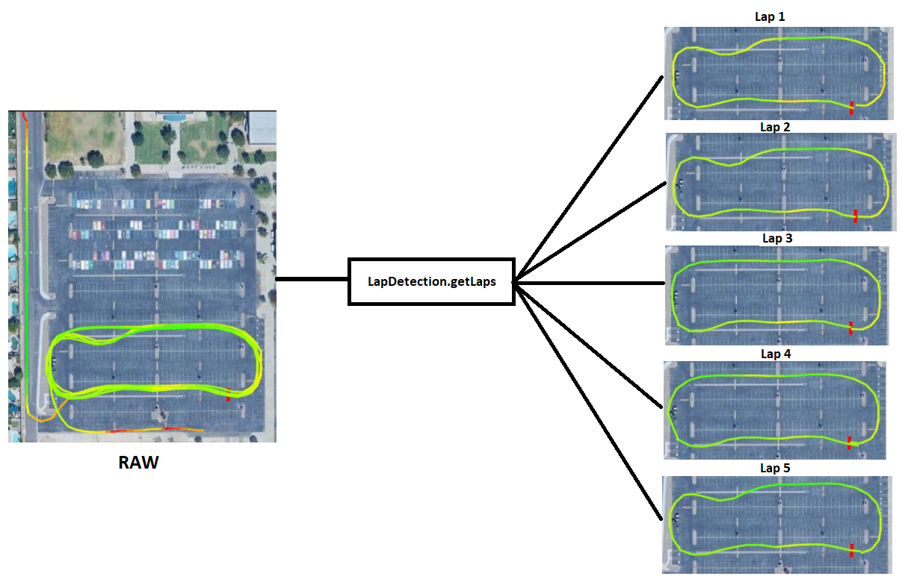

# GPS Lap Timer
An Android app that uses your phone's GPS to automatically track and detect laps, providing insight into performance for circuit-based activities.

    

## Features
- **GPS Tracking:** Utilizes the phone's GPS for location tracking.
- **Automatic Lap Detection:** Automatically detects lap completions and calculates lap times and lap-to-lap time variations.
- **History Management:** Saves tracking sessions for later review and analysis, giving insight to performance progression.
- **Map Visualization**: Uses Google Maps API to visually display laps.
- **Settings**: Allows users to adjust parameters used for the lap detection algorithm.

## Main Components
- **AddFragment**: Handles GPS tracking, data logging, and file saving.
- **MapFragment**: Visualizes tracked laps on a Google Map and displays lap statistics.
- **HistoryFragment**: Displays past sessions.
- **Settings Fragment**: Allows for adjustment of parameters.
- **LapDetection**: Contains the algorithm for detecting laps and calculating lap times.
- **MapDrawing**: Contains various functions that interact and draw on the Google Map.

## Requirements
- Android device with ideally 1hz GPS capability
- A Google Cloud API Key with the following 3 APIs activated: Maps SDK for Android, Maps JavaScript API, Geocoding API. **Put this API Key into the secrets.properties file**.

## Lap Detection Algorithm

    

LapDetection.getLaps is the main function and involves the follow steps:

1. **Finish Line Detection**: 
   - Create a grid of the track area, consisting of "gridSize" sized grids (adjustable in settings).
   - The first time a grid is passed through, it is assigned a direction. Subsequent points that pass through are added if they are within the direction variance (adjustable in settings).
   - Identify the most frequently crossed grid cell as the finish line.

2. **Lap Identification**:
   - Detect intersections between the GPS points and the finish line.
   - Each valid intersection marks a lap completion.

3. **Lap Time Calculation**:
   - Calculate lap times using GPS point timestamps.
   - Use linear interpolation at finish line crossings for precise timing.

4. **Performance Analysis**:
   - Identify the fastest lap.
   - Calculate time variations between laps.

This algorithm allows for automatic lap detection and timing without requiring predefined track information.
